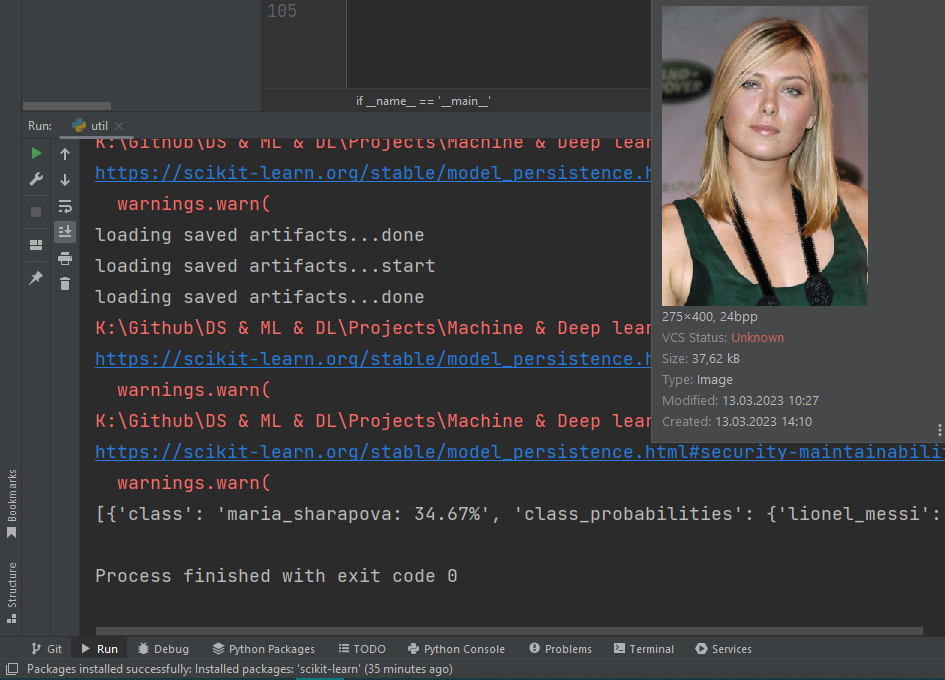

# Celebrity Face Recognition

This project is a web application that allows users to upload images and get predictions on the celebrity faces present in the image. The application uses various machine learning models to classify images of celebrities, achieving an accuracy of around 80%.

## Table of Contents
* [Dataset](#Dataset)
* [Folder Structure](#Folder-Structure)
* [Technologies](#Technologies-Used)
* [Website Interface](#Website-Interface)
* [Improved Results](#Improved-Results)
* [Conclusion](#Conclusion)

## Dataset
The project used two celebrities datasets to train the models:

* [Kaggle 5 Celebrity Faces Dataset](https://www.kaggle.com/datasets/dansbecker/5-celebrity-faces-dataset)
* [Code Basics Dataset](https://github.com/codebasics/py/tree/master/DataScience/CelebrityFaceRecognition/model/dataset)

The celebrities included in this project are Jerry Seinfeld, Ben Affleck, Maria Sharapova, Serena Williams, Virat Kohli, Roger Federer, Lionel Messi, Madonna, and Mindy Kaling.

## Folder Structure
The project has the following folder structure:

* UI: Contains the HTML, CSS, and JavaScript code for the website
* model: Contains the Python notebook for model building and dataset
* server: Python Flask server

## Technologies Used
* OpenCV for data cleaning
* Sklearn for model building
* HTML/CSS/JavaScript for UI
* Python Flask for HTTP server
* Amazon EC2 for cloud hosting

## Website Interface
The website has a simple and intuitive interface that allows users to upload images and get predictions on the celebrity faces present in the image. The user can upload an image by dragging and dropping it onto the webpage, or by selecting the file using the browse button. After the image is uploaded, the application shows the predicted celebrity names and their corresponding confidence scores.

### Old interface:

### Imporved interface:

## Improved Results
Some imporovments were made, for instance: the "if_2_eyes" function to return all the faces in the picture. A slight imporvment to the UI as well. In addition to that, several ML models haven been used including catboost.

Here are some sample testing results after the improvements made to the code:

# Conclusion
This project successfully classified the faces of various celebrities with an accuracy of around 80%. The use of machine learning models and OpenCV for data cleaning and preparation allowed for effective image classification. The user interface also provided a seamless experience for users to upload and classify images.

